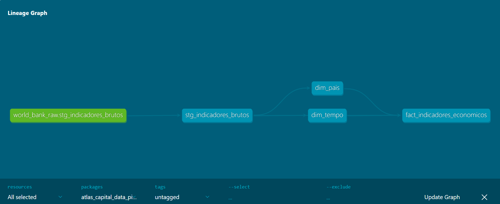

# 📊 **Atlas Capital: Pipeline ELT e Modelagem de Indicadores Macroeconômicos**

---

## 💡 **Simulação de um cenário de negócio**

A **Atlas Capital (empresa fictícia)** é um fundo de investimentos de pequeno porte, especializado em mercados emergentes. Seu time de análise acompanha indicadores macroeconômicos — como PIB, inflação e desemprego — para embasar decisões estratégicas em países-chave da América Latina, Ásia e África.

Antes deste projeto, os dados eram coletados manualmente a partir de fontes públicas, gerando retrabalho, inconsistências e alto custo operacional. Com orçamento zero para aquisição de soluções comerciais, surgiu a necessidade de construir um sistema automatizado de fornecimento de dados.

Utilizando apenas ferramentas <u>open source e dados públicos confiáveis</u>, este projeto implementa um pipeline de dados totalmente automatizado, consumindo dados da World Bank Data360, padronizando indicadores macroeconômicos e disponibilizando-os em um Data Warehouse analítico no BigQuery, pronto para análises, visualizações e expansão futura.

---

## 🏗️ **Arquitetura do Projeto (Modern Data Stack)**

O projeto segue o paradigma ELT (Extract, Load, Transform), priorizando o processamento dentro do Data Warehouse para escalabilidade e baixo custo.

---

### ⚙️ **Stack Tecnológica**

| Componente     | Tecnologia      | Papel no Pipeline                                                  |
|:---------------|:----------------|:-------------------------------------------------------------------|
| Linguagem      | Python 3.12     | Scripts de extração de API e carga resiliente.                     |
| Data Warehouse | Google BigQuery | Armazenamento colunar em nuvem (Camadas Raw, Staging e Marts).     |
| Transformação  | dbt Core        | Engenharia Analítica, modelagem dimensional e testes de qualidade. |
| Orquestração   | GitHub Actions  | Automação diária (Cron Job) e integração contínua (CI/CD).         |
| Infraestrutura | Terraform       | Definição da arquitetura de datasets como código (IaC).            |
| Visualização   | Looker Studio   | Dashboard executivo para tomada de decisão.                        |

---

## 🚀 **Detalhes Técnicos e Engenharia**

1. **Ingestão (Python)**
* Extração de 5 indicadores macroeconômicos para 6 países emergentes.
* **Resiliência:** Tratamento de erros de API e loops iterativos para contornar limitações de endpoints públicos.
* **Idempotência:** Cargas configuradas para garantir que execuções repetidas não dupliquem dados.
2. **Modelagem de Dados (dbt Core)**
* **Arquitetura de Medalhão:** Organização em camadas stg_ (limpeza), dim_ (dimensões) e fact_ (fatos).
* **Star Schema:** Implementação de tabelas dimensionais (dim_pais, dim_tempo) e tabela fato pivoteada para alta performance em BI.
* **Data Quality:** 10/10 testes aprovados (Unique, Not Null e Referential Integrity).
3. **Automação (CI/CD)**
* Pipeline configurado no GitHub Actions para rodar diariamente sem intervenção manual.
* Injeção dinâmica de segredos (GCP Service Account) via Base64 para máxima segurança.

---

## ✅ **Resultados**

* **Situação:** Decisões de investimento baseadas em processos manuais e dados não validados.
* **Tarefa:** Automatizar o fluxo fim a fim com custo zero de infraestrutura.
* **Ação:** Implementei um pipeline ELT completo integrando Python, BigQuery e dbt com automação via GitHub Actions.
* **Resultado:** Redução de 100% no esforço manual de coleta e 100% de confiança nos dados através de testes automatizados, além de <u>custo zero de infraestrutura</u>.

---

## 🔗 **Links e Artefatos**

* **Dashboard Interativo:** https://lookerstudio.google.com/reporting/b6ce62da-b856-4e12-a64c-80e30c5c75a8
* **Documentação dbt (Lineage):** https://revsonv.github.io/atlas-capital-data-pipeline/#!/overview
* **Perfil no LinkedIn:** https://www.linkedin.com/in/revson-vieira-0a753057/

---

## 🛠️ **Como Reproduzir**

1. Clone o repositório.
2. Configure as credenciais do GCP no arquivo .env (local) ou GitHub Secrets.
3. Execute pip install -r requirements.txt.
4. Rode o script de ingestão: python src/ingestion_pipeline.py.
5. Execute as transformações: dbt run e dbt test.

*Desenvolvido por Revson Vieira como projeto de portfólio para Engenharia de Dados.*